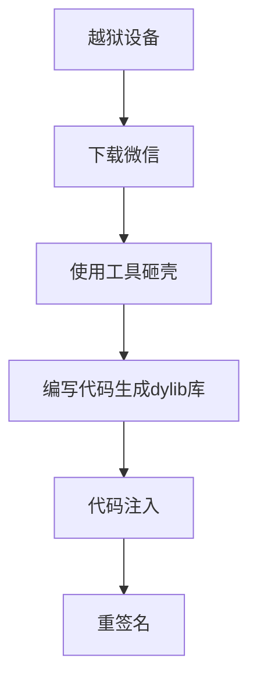
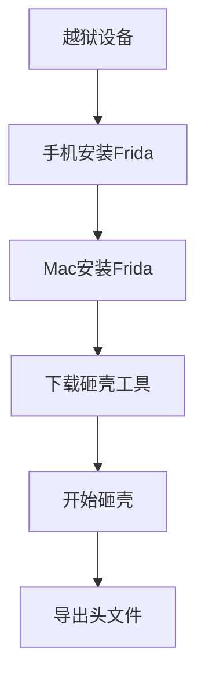

@[TOC](ios逆向工程砸壳的应用)

# W.X抢红包功能介绍
## 1.我们先来看下效果
### 1.1 W.X自动抢红包
[自动抢红包效果展示](https://wds0.com/wds/video.html)

### 1.2 W.X步数修改

### 1.3 防撤回


## 2.关于抢红包整体的思路


抢红包教程分三次：
第一部分： 关于应用的砸壳解密教程.
第二部分： 关于动态库的注入
第三部分： 关于应用重签名打包
## 3.本次砸壳的主要流程

本篇主要讲解关于应用的砸壳解密,通过解密后的文件导出微信头文件



# 一. 设备越狱

下载Mac版本爱思助手，链接设备，找到一键越狱。
越狱成功以后，手机会出现应用Sileo,此时你打开Sileo会无法连接网络，用爱思助手安装乐网（红色图标即VPN），打开乐网后在打开Sileo即可连接应用
 


# 二. 手机安装Frida

## 1. 打开Sileo，添加源: https://build.frida.re （注意留意一下版本Frida的版本号）
## 2. 打开刚刚添加的源 安装 Frida


# 三. Mac安装Frida
##  1.安装Frida
>sudo pip3 install frida
  
 注意: Mac必选安装pip指令,才能执行上述命令
>sudo easy_install pip

## 2.报错
假如报以下错误:
>Uninstalling a distutils installed project (six) has been deprecated and will be removed in a future version. This is due to the fact that uninstalling a distutils project will only partially uninstall the project.

执行命令:
>sudo pip3 install frida –upgrade –ignore-installed six

## 3.查看Frida版本
>frida --version
14.2.15

需要注意的地方，电脑和手机的frida版本要保持一致，不一致可能会出问题。
检查frida是否正常运行，任意mac终端输入frida-ps -U有数据返回表示成功安装，-U表示USB设备，-ps表示进程。
如果确定frida --version有正常返回&USBSSH连接也没问题，还是出现Waiting for USB device to appear...本人解决方法如下，亲测可以，这个坑踩了很久
>sudo pip3 install frida-tools //继续执行这个命令

再次查看结果
```
apple@appledeiMac-2 ~ % frida-ps -U
 PID  Name
----  -------------------------------------------------
5364  App Store
5802  Sileo
4206  邮件
ookmarksd
 819  wifid
 844  wirelessproxd
 //终端输出很多，我只是截取了一部分
apple@appledeiMac-2 ~ % 
```
# 四. 下载砸壳工具
砸壳工具不在使用dumpdecrypted砸壳，相比较frida-ios-dump来说有些复杂

新的砸壳工具 [frida-ios-dump](https://github.com/AloneMonkey/frida-ios-dump)
如果github下载失败可以在这里下载
## 1.mac安装usbmuxd
>brew install usbmuxd
如果你没有安装brew
请先安装
/usr/bin/ruby -e "$(curl -fsSL https://raw.githubusercontent.com/Homebrew/install/master/install)"
## 2.手机安装OpenSSH
默认安装手机中有
如果手机中没有则参考
[https://www.jianshu.com/p/725843850e1d](https://www.jianshu.com/p/725843850e1d)
## 3.Mac终端安装python
默认安装Mac中有

## 4.USB&SSH连接iPhone
*终端输入
>iproxy 2222 22
>说明：将当前连接设备的22端口映射到电脑的2222端口上，继而来连接SSH。
>
*同时打开另一个终端输入
>ssh -p 2222 root@127.0.0.1
>说明：127.0.0.1是默认本机回环地址。

输入ssh密码即可（默认密码alpine)

```
ssh -p 2222 root@127.0.0.1                                              
The authenticity of host '[127.0.0.1]:2222 ([127.0.0.1]:2222)' can't be established.
RSA key fingerprint is SHA256:GXJI2exWQ528kEvqy9rypfY6jE7P8QvnfoSn+dCfsyg.
Are you sure you want to continue connecting (yes/no/[fingerprint])? yes
Warning: Permanently added '[127.0.0.1]:2222' (RSA) to the list of known hosts.
root@127.0.0.1's password: 
iPhone6S:~ root# passwd
Changing password for root.
New password:
Retype new password:
iPhone6S:~ root# 
```

## 5.frida-ios-dump使用
解压下载好的:frida-ios-dump
cd到frida-ios-dump目录中执行:
>cd frida-ios-dump
sudo pip3 install -r requirements.txt --upgrade
// dump.py参数不用修改(教程说让修改端口号)

再次执行:
>python3 dump.py -l    
// 必须是在frida-ios-dump文件夹中执行的

当你看到以下内容说明执行成功:
```
apple@appledeiMac-2 frida-ios-dump-master % python3 dump.py -l  
 PID  Name          Identifier                 
----  ------------  ---------------------------
5364  App Store     com.apple.AppStore         
5802  Sileo         org.coolstar.SileoStore    
4206  邮件            com.apple.mobilemail       
   -  Cydia         com.saurik.Cydia           
   -  Electra       org.coolstar.electra1141   
   -  FaceTime 通话   com.apple.facetime         
   -  Safari 浏览器    com.apple.mobilesafari     
   -  Watch         com.apple.Bridge           
   -  iBooks        com.apple.iBooks           
   -  iTunes Store  com.apple.MobileStore      
   -  乐网            com.seven.adclear          
   -  信息            com.apple.MobileSMS        
   -  健康            com.apple.Health           
   -  地图            com.apple.Maps             
   -  备忘录           com.apple.mobilenotes      
   -  天气            com.apple.weather   
```

## 6.砸壳
还是在当前的目录下输入:
>python3 dump.py bundle id
>//bundle id就是上面列表当中列出来的bundle id

执行成功以后会显示如下信息,砸壳以后的.ipa文件会出现在当前文件夹中

说明:执行**python3 dump.py bundle id**的时候，一定要确保手机中这个应用在运行状态，不能再后台运行
```
(gwc) admindeMBP-4:frida-ios-dump admin$ python3 dump.py com.crossutility.quantumult
Start the target app com.crossutility.quantumult
Dumping Quantumult to /var/folders/09/1sjc1d4x2tnf9_d3rfpwl9pr0000gn/T
start dump /var/containers/Bundle/Application/4F25C441-0ED6-4B8A-BACC-C3DAEC389DAC/Quantumult.app/Quantumult
Quantumult.fid: 100%|█████████████████████████████████████████████████████████████████████| 3.00M/3.00M [00:00<00:00, 3.90MB/s]
start dump /private/var/containers/Bundle/Application/4F25C441-0ED6-4B8A-BACC-C3DAEC389DAC/Quantumult.app/Frameworks/Sodium.framework/Sodium
Sodium.fid: 100%|█████████████████████████████████████████████████████████████████████████| 42.3k/42.3k [00:00<00:00, 1.58MB/s]
start dump /private/var/containers/Bundle/Application/4F25C441-0ED6-4B8A-BACC-C3DAEC389DAC/Quantumult.app/Frameworks/CocoaLumberjack.framework/CocoaLumberjack
CocoaLumberjack.fid: 100%|██████████████████████████████████████████████████████████████████| 173k/173k [00:00<00:00, 5.78MB/s]
start dump /private/var/containers/Bundle/Application/4F25C441-0ED6-4B8A-BACC-C3DAEC389DAC/Quantumult.app/Frameworks/lwip.framework/lwip
lwip.fid: 100%|███████████████████████████████████████████████████████████████████████████| 98.6k/98.6k [00:00<00:00, 1.58MB/s]
Localizable.strings: 12.6MB [00:02, 4.96MB/s]         
0.00B [00:00, ?B/s]Generating "Quantumult.ipa"

(gwc) admindeMBP-4:frida-ios-dump admin$ 
```


## 7.检验砸壳是否成功
找到刚才的导出的.ipa文件，拷贝一份放到桌面

把.ipa改成zip，然后解压文件,进入文件夹
 
 输入命令:
 >WeChat.app % otool -l WeChat | grep -B 2 crypt

如果出现：
> cmd LC_ENCRYPTION_INFO_64
      cmdsize 24
     cryptoff 16384
    cryptsize 130711552
      cryptid 0  		//0代表砸壳成功，1代表未成功
      
# 五. 导出微信头文件
## 1.下载[class-dump](https://github.com/nygard/class-dump)
下载成功以后运行肯定是报错的，这个坑又被我踩了很久.

你只需要找到class-dump可执行文件，拷贝到 /usr/local/bin 这个路径中


## 2.导出头文件
打开终端在当前输入命令
>class-dump -H /Users/apple/Desktop/ipa/Payload/WeChat.app -o /Users/apple/Desktop/ipa

/Users/apple/Desktop/ipa/Payload/WeChat.ap是计算器app的路径
/Users/apple/Desktop/ipa 是存放dump出来头文件的文件夹路径

如图:


# 下一篇会讲解代码的注入

